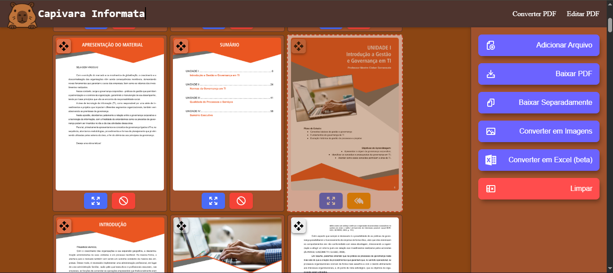

# 🦫 Capivara Informata - Manipulador de PDF


Bem-vindo ao **Capivara Informata**, um projeto web desenvolvido em **Angular** para manipulação inteligente de arquivos **PDF**. Com ele, você pode visualizar páginas do PDF como imagens, selecionar quais deseja manter ou excluir, reorganizar via drag-and-drop, e baixar o arquivo completo ou páginas separadas com facilidade.

🔗 **Acesse aqui**: [https://capivara-informata.vercel.app](https://capivara-informata.vercel.app)

---

## ✨ Funcionalidades

- 📁 Upload de arquivos PDF.
- 🔍 Visualização das páginas como imagens renderizadas.
- ✅ Seleção das páginas a serem mantidas ou excluídas.
- 🧩 Reordenação das páginas com **drag-and-drop**.
- 💾 Download:
  - PDF final com páginas selecionadas.
  - Cada página selecionada como PDF separado.
- 🧹 Limpeza de arquivos carregados.
- 💡 Visualização de página em destaque com modal.

---
##  📷  Imagens


## 🧪 Tecnologias Utilizadas

- [Angular 19](https://angular.io/)
- [pdf-lib](https://github.com/Hopding/pdf-lib)
- [pdfjs-dist (PDF.js)](https://github.com/mozilla/pdf.js)
- [Angular CDK DragDrop](https://material.angular.io/cdk/drag-drop/overview)
- SCSS moderno com animações e estilização personalizada

---

## 🚀 Como Rodar Localmente

```bash
git clone https://github.com/seu-usuario/capivara-informata.git
cd capivara-informata
npm install
ng serve
